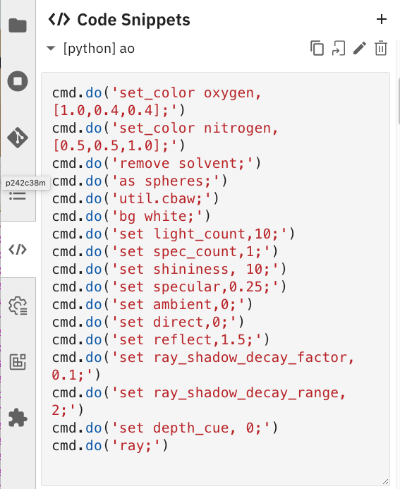

# taggedpymolpysnips: Tagged code templates for running PyMOL from JupyterLab

[](https://opensource.org/licenses/MIT)


For a list of the snippets and their descriptions, also go to the [GitHub Page](https://mooerslab.github.io/pymolsnips/).

<a id="table-of-contents"><h2>Table of Contents</h2></a>

* [Related repos](#related)
* [Motivation](#motivation)
* [New to scripting in PyMOL](#new)
* [Tech Stack](#technology-stack)
* [Installation](#installation)
* [Configuration Setup](#configuration-setup)
* [Usage](#usage)
* [Testing](#testing)
* [Requests for new snippets and text editors](#requests)
* [Bug reports](#bugreports)
* [Roadmaps](#roadmap)
* [License](#license)
* [Contact Information](#contact-information)
* [How to cite](#citation)

<a id="related"><h2>Related repos</h2></a>

### PyMOL in Jupyter
- [jupyterlabpymolpysnips](https://github.com/MooersLab/jupyterlabpymolpysnips) PyMOL Python snippets for use in JupyterLab with the jupyterlab-snippets extension.
- [jupyternbclassicpymolpysnipsplus](https://github.com/MooersLab/jupyternbclassicpymolpysnipsplus)
- [taggedpymolpysnips](https://github.com/MooersLab/taggedpymolpysnips) 
- [taggedpymolpysnipspymolpysnipsplus](https://github.com/MooersLab/taggedpymolpysnipspymolpysnipsplus)
- [jupyter-vsc-pymolpysnips](https://github.com/MooersLab/jupytervsc-pymolpysnips)
- [jupyter-st3-pymolpysnips](https://github.com/MooersLab/jupyter-st3-pymolpysnips)
- [jupyter-emacs-pymolpysnips](https://github.com/MooersLab/jupyter-emacs-pymolpysnips)
- [jupyter-ultisnips-pymolpysnips](https://github.com/MooersLab/jupyter-ultisnips-pymolpysnips)
- [jupyter-snipmate-pymolpysnips](https://github.com/MooersLab/jupyter-snipmate-pymolpysnips)
- [jupyter-neosnippets-pymolpysnips](https://github.com/MooersLab/jupyter-neosnippets-pymolpysnips)
- [jupyter-atom-pymolpysnips](https://github.com/MooersLab/jupyter-atom-pymolpysnips)

### PyMOL on other coding platforms  
- [easypymol](https://github.com/MooersLab/EasyPyMOL/edit/master/README.md)
- [pymolshortcuts](https://github.com/MooersLab/pymolshortcuts)
- [orgpymolpysnips](https://github.com/MooersLab/orgpymolpysnips)
- [rstudiopymolpysnips](https://github.com/MooersLab/rstudiopymolpysnips)
- [jupyterlabpymolpysnips](https://github.com/MooersLab/jupyterlabpymolpysnips)
- [colabOpenSourcePyMOLpySnips](https://github.com/MooersLab/colabOpenSourcePyMOLpySnips)
- [colabPyMOLpySnips](https://github.com/MooersLab/colabPyMOLpySnips)
- [PyMOLwallhangings](https://github.com/MooersLab/PyMOLwallhangings)

[Return to Table of Contents](#table-of-contents)


<a id="motivation"><h2>Motivations for this project</h2></a>

### Why run PyMOL in JupyterLab?

#### 1. JupyterLab is easy to use.

The code cells are easy to execute and edit with help from the menu pull-downs.
The keyboard shortcuts for Jupyter are modest in number and fast to master.


#### 2. Illustrate JupyterLab with molecular images

You can illustrate your **JupyterLab** documents with images created in **PyMOL**.
You can also adjust molecular images from within **JupyterLab** without having to open **PyMOL**, thereby saving time.


#### 3. Jupyter notebooks are easy to edit in JupyterLab <!--  -->

The Jupyter notebooks have a gentle learning curve because they are easy to edit.
The code blocks can be run individually during the development of the code or all of the code block can be run at once.


#### 4. Combine PyMOL output with statistical packages

The output from structure analysis can be directly imported into a pandas DataFrame and then onto a Phython or R statistical package for further analysis.
The presence of output from **PyMOL** and statistical packages in the same document eases the tracking of the results and supports reproducible research.


#### 5. Streamlines the management of images for a project
The images generated by **PyMOL** can be stored in one Jupyter notebook file as opposed to having dozens of script and images files sequestered in numerous subfolders.
The use of one file greatly eases finding the code to make a particular figure because the code and image can be next to each other.
This ability to easily find the required code at a later time reduces the resistance to remaking a figure for manuscript resubmission, journal cover artwork, posters, platform presentations, lectures, book chapters, review articles, websites, and wall hangings.

The use of one file also eases the sharing of images with collaborators because only one file needs to be shared.
If the collaborators are not **PyMOL** or **JupyterLab** users, the notebook file can be reformatted as a PDF or HTML file.

However, remember that although the stored images and data in a Jupyter notebook will be displayed upon reloading of the notebook, these objects are not in the current state of the computer and cannot be accessed. 
The objects have to be recreated from scratch to be able to work on them.


#### 6. Facilitates combining PyMOL with other software in molecular structure analysis

Other software can be run from the same notebook during a molecular structure analysis project provided that this software has a Python API.
This can improve the reproducibility of the computational aspects of your research.

[Return to Table of Contents](#table-of-contents)


### But I will miss the interactive viewport in PyMOL!

1. You can run the PyMOL GUI next to your **JupyterLab** session. You can adjust the molecule's orientation manually, run the **get_view** command, and copy the output in the command history window from **PyMOL** and paste it into a cell in the **Jupyter notebook**.
The one line of settings returned by the **rv** shortcut is much easier to work with (see [PyMOL shortcuts](https://github.com/MooersLab/pymolshortcuts)). 

2. You do not need the viewport. With 10-15 minutes of practice, you can master the rapid iterating of **rotate** and **translate** commands to adjust the molecule's orientation with greater precision than via manipulation of the mouse. You can use the up arrow to reuse prior commands and to edit and rerun prior commands.                                                                                                                                                                                                                                                                                                                                                        

[Return to Table of Contents](#table-of-contents)


<a id="new"><h2>New to PyMOL scripting?</h2></a>

If you are not ready to write **PyMOL** scripts, please consider using [PyMOL shortcuts](https://github.com/MooersLab/pymolshortcuts) to enhance your productivity in **PyMOL** interactive sessions.
For example, the above ambient occlusion effect can be invoked at any time by entering **AO** at the **PyMOL** prompt, if the *pymolshortcuts.py* file has been loaded.
These shortcuts can also be invoked in **JupyterLab** by submitting them as arguments to the cmd.do() method, (e.g., cmd.do("AO") to generate the ambient occlusion effect.)

## Application Description

The **taggedpymolpysnips** library contains 260 code fragments (i.e, templates or snippets) written in Python to run **PyMOL** in **JupyterLab** via **PyMOL**'s **Python** API.
This API is only available for recent versions of **PyMOL**.
This API is available for both the incentive and open-source versions of **PyMOL**.

[Return to Table of Contents](#table-of-contents)


<a id="technology-stack"><h2>Technology Stack</h2></a>

| Technology       | Version  | Description       |
|------------------------------------------|----------|----------------------------|
| [PyMOL](https://pymol.org/2/)  | 2.5.1    | Molecular graphics program    |
| Python from Anaconda    | 3.8  | Programming language               |
| conda from Anaconda       | 4.10.1   | Program used to create Python environments.     |
| git     | 2.33   | Eases the downloading and updating of the libraries.    |
| Node.js | >12.2        | Needed for Jupyter extensions. Often the Node.js from Anaconda is out-dated. Install from Node.js website. |
| Jupyter |        | needed to created kernel mapped to PyMOL's Python interpreter |
| JupyterLab  | >3.0 |  Required for Elyra snippets |
| elyra-code-snippet-extension | > 3.3 | suports tagged snippets  |


Some of the snippets are limited to Python3 code.
If you are using an ancient version of **PyMOL** that relies on Python2, you can buy a license to the current version of **PyMOL**, install a free open-source version of **PyMOL** that depends on Python3 (See the [PyMOL Wiki](https://pymolwiki.org/index.php/Main_Page)), or you can rewrite the snippet's code to be Python2 compliant. 
This often merely involves replacing print functions in Python3 with print statements in Python2.
Note that multiple versions of **PyMOL** can operate side-by-side on a computer, so you do not have to delete the old version of **PyMOL**.

Note that PyMOL 2.5.0 is available from macports for python 3.6 to 3.9.
After installing pymol for python 3.9, you can make a Python kernel for this Python with the following command:

```bash
/opt/local/bin/python3.9 -m ipykernel install --user --name mp39 --display-name "Macports Python 3.9"
```

This kernel will show up in the pulldown for kernels as `Macports Python 3.9`.
It is stored on the Mac in `~/Library/Jupyter/kernels/mp39`.

The naming convention for the jupyter packages that is used by macports is confusing.                                       
Instead, I recommend creating instead a conda environment to install Jupyter Lab from Anaconda and then the Juptyer Lab extensions. 
After launching Juptyer Lab, you can select the `Macports Python 3.9` kernel to access the pymol API through macports.
This works despite the claim the your conda env is isloted from the rest of your Python ecosystem.


<a id="installation"><h2>Installation of the snippet library</h2></a>
Install the software stack.
Make the jupyter kernel mapped to the PyMOL Python interpreter.
Install the elyra-code-snippet-extension.
Now download the 

```bash
# If the following directory is missing: ~/Library/Jupyter/metadata
mkdir ~/Library/Jupyter/metadata
cd ~/Library/Jupyter/metadata
git clone https://github.com/MooersLab/taggedpymolpysnips.git 
cd taggedpymolpysnips
mv code-snippets ../.
cd ..
rm -rf taggedpymolsnips
```

When you open **JupyterLab**, you will find a `</>` icon in the left column.
Click on it to display a list of available snippets.
The snippets are clustered by language.
The PyMOL snippets are clustered as Python.

<p align="center"></p>


[Return to Table of Contents](#table-of-contents)

<a id="configuration-setup"><h2>Configuration Setup</h2></a>

The snippet library is independent of **PyMOL**. 
No modification of **PyMOL** is required. 

[Return to Table of Contents](#table-of-contents)


<a id="usage"><h2>Usage</h2></a>

The planned animation at the top of the page will convey the essential knowledge for usage. 

In the meantime, the static images will have to do.
First, select the appropriate kernel from the list of icons and open a new notebook.
Select a cell.
Second, select a snippet form the menu. For example, selection of the `ao` snippet leads to the display of its content.

<p align="center"></p>

Select the second icon form the left in the upper right to insert the snippet into the selected cell of the notebook.

To add a new snippet, click on the `+` in the upper right of the Code Snippets icon.
This will open new GUI (see below) for creating a snippet.

- The `Name` should be a one word or compound word.
- The `Description` describes in one or more sentences what the snippet does. 
- The Tags are used to narrow the listing of snippets in the menu.
- The Source is Python.
- The Code can be entered by selecting code in a notebook cell or copying and pasting from a script file.
- Save & Close.

<p align="center"></p>


[Return to Table of Contents](#table-of-contents)


<a id="testing"><h2>Testing</h2></a>

Run the code cells the `ipynbs/ao.ipynb` notebook to test that the connection to PyMOL's API is working. The output should be the same as in `ipynbs/7JU5setview.png`.


[Return to Table of Contents](#table-of-contents)


<a id="requests"><h2>Requests for new snippets</h2></a>

Please use the **Issues tab** above to request support for additional snippets or to ask questions.
Alternatively, you can send [e-mail](#contact-information) to me.

Questions about **PyMOL** should be directed to the [PyMOL Mailing List](https://pymolwiki.org/index.php/PyMOL_mailing_list).

[Return to Table of Contents](#table-of-contents)


<a id="requests"><h2>Contributing</h2></a>

Snippets of new code are most welcome. Send to [e-mail](#contact-information).

- Submit the Python code in a plain text file.
- Write the filenames and function names in camelCase.
- Describe what the code does in one to several sentences, an example of usage, and any citations or links to further information.

[Return to Table of Contents](#table-of-contents)


<a id="bugreports"><h2>Bug reports</h2></a>

Use the **Issues** tab above to report bugs or send [e-mail](#contact-information) to me.

[Return to Table of Contents](#table-of-contents)


<a id="roadmap"><h2>Roadmap</h2></a>

I plan to expand the library to cover with examples the 500 commands and 600 settings in **PyMOL**.

[Return to Table of Contents](#table-of-contents)


<a id="license"><h2>License</h2></a>

We use the permissive MIT license.
The license information for this project is found in the *License.txt* file above. 

[Return to Table of Contents](#table-of-contents)


<a id="contact-information"><h2>Contact Information</h2></a>

Reach me via the Issue tab above or via e-mail: `blaine-mooers at ouhsc.edu`.

[Return to Table of Contents](#table-of-contents)


<a id="citation"><h2>Citation</h2></a>

If you use this library to make figures for publication, please see the *Citation.md* file above.


[Return to Table of Contents](#table-of-contents)

